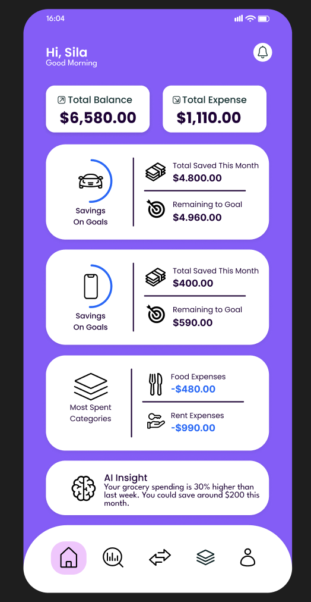
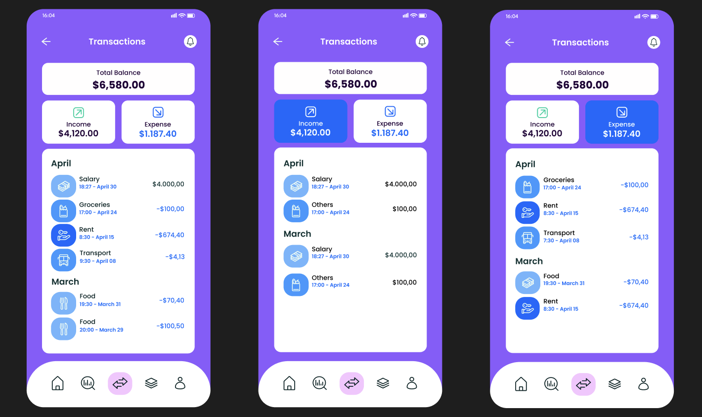
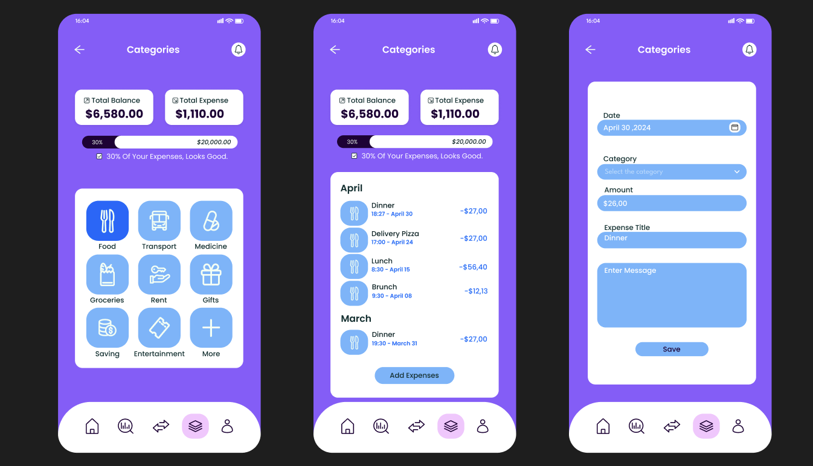
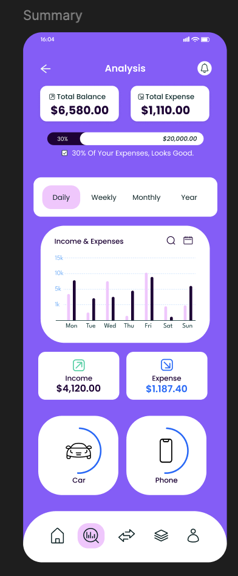
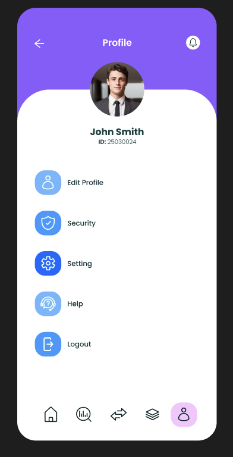

# AI Budget Assistant – Product Case Study

## Overview
AI Budget Assistant is a personal finance mobile app designed to help users
understand where their money goes, automatically categorize expenses,
and build simple budgeting habits with AI-powered insights.

This project is an end-to-end **product case study**, focusing on
product thinking, user experience, MVP definition, and success metrics
rather than software development.

---

## Problem
Many young users struggle to manage their personal finances due to
low financial visibility, irregular income, and the complexity of
existing budgeting tools.

Even users with stable income often cannot clearly answer the question:
**“Where did my money go?”**

This leads to poor budgeting habits, financial stress, and lack of savings.

---

## Target Users
- **University students** with irregular or limited income
- **First-year white-collar professionals** struggling with budgeting discipline
- **Freelancers** with unstable cash flow and changing monthly income

---

## Solution
AI Budget Assistant connects to users’ bank accounts (conceptually),
automatically categorizes transactions using AI, and presents financial
data through a clean and simple interface.

The product focuses on:
- Financial visibility
- Simple budgeting
- Actionable insights
- Fast and frictionless user experience

---

## Core User Flow
Connect Bank → Track Transactions → Categorize Spending →
Set Budget & Goals → View Monthly Insights

---

## MVP Scope

### Included in MVP
- Bank account connection (concept level)
- Automatic transaction fetching
- AI-based expense categorization (basic)
- Home dashboard with total balance and expenses
- Category-based expense view
- Basic budgeting functionality
- Simple savings goals
- Monthly financial summary
- Basic notification logic

### Excluded from MVP
- Multi-currency support
- Advanced AI forecasting
- Subscription management
- Premium monetization features
- PDF exports and reports
- Social or community features

---

## Key Screens
Figma design link:
👉 **(https://www.figma.com/design/piVFEbfVh021GgKt8M7nWA/AI-BUDGET-APP?node-id=0-1&t=3WkObh5t1nV1QR7m-1)**

Screens included in this case study:
## UI Screens

### Home / Dashboard

### Transactions

### Categories

### Monthly Summary

### Profile

---

## KPIs
- Account linking rate
- Time to first insight
- Budget creation rate
- Goal creation rate
- 7-day user retention
- Monthly active users (MAU)
- AI categorization accuracy (basic)

---

## Risks & Considerations
- User trust in bank account connections
- AI categorization accuracy in early stages
- User retention after the first week
- Financial app fatigue among young users

---

## Next Steps
- Advanced AI insights and recommendations
- Budget automation
- Subscription detection
- Multi-currency support
- Premium feature experimentation

---

## Role & Responsibilities
End-to-end product ownership including:
- Problem definition
- User personas
- MVP scoping
- User flows
- Wireframing and UI design
- KPI definition
- Risk analysis
